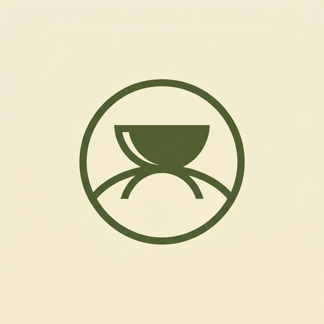
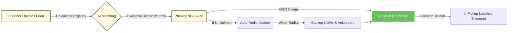

<div align="center">
  <h1>
     
    Aahara Setu
  </h1>
  <p><strong>A Circular Food Redistribution Network designed to permanently eliminate urban food waste.</strong></p>

  <p>
    <a href="https://reactjs.org/"></a>
    <a href="https://vitejs.dev/"></a>
    <a href="https://www.typescriptlang.org/"></a>
    <a href="#"></a>
  </p>
</div>

<br/>

## 🎯 The Mission
Globally, **one-third** of all food produced is wasted while millions go hungry. **Aahara Setu** bridges this gap using real-time urgency mapping, instantly connecting surplus food from high-volume generators (hotels & restaurants) to those in need (NGOs & shelters).

> **For Businesses:** Turn costly food waste into tax write-offs, lower garbage-disposal bills, and powerful marketing PR. <br>
> **For NGOs:** Receive high-quality, hot meals exactly when you need them.

---

## ⚡ How It Works (The Lifecycle)



---

## 🧩 Core Features

| Feature | Description |
| :---: | :--- |
| 🧮 **Dynamic Urgency Scoring** | Advanced algorithm scoring each listing (0-100) based on remaining expiry time, food type, distance, and real-time demand. |
| 🔁 **Auto-Redistribution** | A failsafe mechanism! If prioritized NGOs do not claim the food within a set time frame, alerts are broadcasted to backup shelters to guarantee zero waste. |
| 🗺️ **Live Radar Map** | Instant visual integration powered by **Leaflet (OpenStreetMap)** to guide volunteers to the donor's exact doorstep. |
| 🌱 **CO₂ Impact Tracking** | Converts kilograms of food rescued into exact tons of carbon emissions prevented. |
| 👔 **B2B Analytics Dashboards** | Providing businesses with "Donation Ledgers", tax-deduction logs, and trackable ESG score upgrades. |

---

## 💻 Tech Stack Overview

- **Frontend:** React 19, TypeScript, React Router
- **Build Tool:** Vite (Ultra-fast HMR)
- **Styling:** Modular CSS, Glassmorphism UI tokens, Responsive Breakpoints
- **Icons & Maps:** Lucide React, OpenStreetMap Web Intent

---

## 🚀 Getting Started

To run the project locally on your machine and experience the dashboard:

```bash
# 1. Clone the repository
git clone https://github.com/bharathkumar000/Aahara-setu.git

# 2. Navigate to project root
cd aahara-setu

# 3. Install NPM dependencies
npm install

# 4. Spin up the development server
npm run dev
```

Visit the displayed standard localhost port (usually `http://localhost:5173`) in your browser.

---

<br/>
<div align="center">
  <sub>Built with 💚 to zero-out hunger.</sub>
</div>
