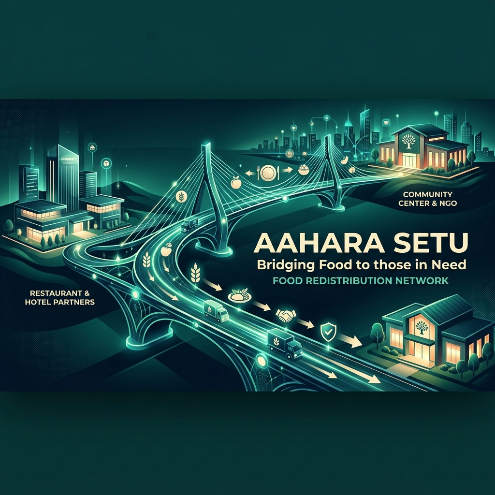
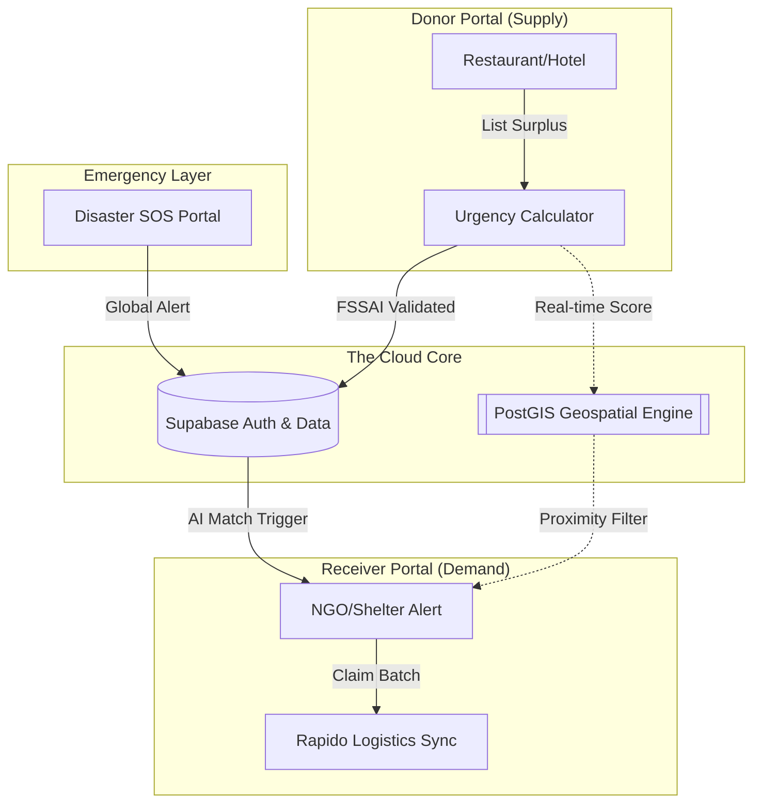

  
  
  <h1>AAHARA SETUU</h1>
  
<i>The Intelligent Bridge Between Food Surplus and Global Need</i>

  
  
  
  

 

## 💎 The Vision: Zero Waste. Zero Hunger.
**Aahara Setu** is not just a platform; it's a high-fidelity logistics engine. We synchronize urban food surplus from hotels/restaurants with real-time NGO demand using **PostGIS-powered geospatial matching** and a **dynamic urgency scoring algorithm**.

---

## 🏗️ System Architecture (The "Aahara Logic")

Aahara Setu operates on a **Decentralized Hub-and-Spoke model**, where Every Donor acts as a "Rescue Node" and Every NGO acts as a "Collection Point".

---

## 🎨 Professional UX/UI Report

Our design system, **"Midnight Cyber-Green"**, is engineered for trust and speed.

### 🍱 The Intelligent Diet Classifier
Aahara Setu handles the complexity of Indian urban diets with 100% precision:
- **Vegan / Vegetarian / Non-Veg**: Primary sorting nodes.
- **Gluten-Free / Nut-Free**: Safe-guarding high-risk recipients.
- **Hygienic Audit**: Every donor must complete a **5-point Safety Check** (Temp, Packaging, Expiry, Contamination, Hygiene) before a listing goes live.

### ⚡ Aahara AI Match & Urgency Score
We don't just list food; we weight it. Our scoring engine (0-100) considers:
1. **🕒 Expiry Delta**: Exponential weight as closing time approaches.
2. **📦 Nutritional Bulk**: Prioritizing high-calorie/protein batches.
3. **📍 Geospatial Radius**: Matching the donor with the *closest* vetted NGO first.
4. **🔥 Disaster Status**: SOS listings bypass all queues to float to the top.

---

## 📈 Strategic Reports & Analytics

### 🌍 Sustainability Impact
| Metric | Conversion Logic | Impact Goal |
| :--- | :--- | :--- |
| **Meals Provided** | 0.4kg Surplus = 1 Human Meal | **1 Million+ Meals** |
| **CO₂ Prevented** | Avoided Landfill Decomposition | **2.5kg CO₂ per Meal** |
| **Trust Score** | Derived from Punctuality & Safety | **98% Network Credibility** |

### 🚚 Micro-Logistics (The Last Mile)
Integrated directly with **Rapido Parcel API** for ultra-fast rescue. 
- **Self-Pickup**: For local NGOs with their own transport.
- **Rapido Parcel**: For high-urgency rescue within 30 minutes.

---

## 🆘 Disaster Relief Portal (The SOS Bridge)
When crisis strikes, Aahara Setu transforms into an **Emergency Response Hub**.
- **On-Ground Broadcasting**: NGOs can broadcast live SOS requirements (e.g., "Need 500 dry meal kits at Assam Sector B").
- **Live SOS Refresh**: Donors see a synchronized global SOS feed, allowing instant institutional contribution.

---

## 🎮 Gamification: The Kindness Hub
We turn social impact into a community achievement.
- **Platinum Donor Status**: For consistent safety compliance.
- **Rescue Hero Badge**: For NGOs with the fastest collection times.
- **Global Leaderboard**: Competing for kindness, not just profit.

---

## 🛠️ Technical Stack (Powering the Bridge)
- **Frontend Core**: React 19 + TypeScript + Vite.
- **Real-time Sync**: Supabase Realtime (WebSockets) for instant claim alerts.
- **Geographic Intelligence**: PostGIS + Leaflet.js for route precision.
- **Visuals**: Lucide Icons, Glassmorphism CSS, Framer Motion (Transitions).

---

  <h3>Ready to bridge the gap?</h3>
  
<i>"For a world where food waste is a memory, and zero hunger is our reality."</i>

  

